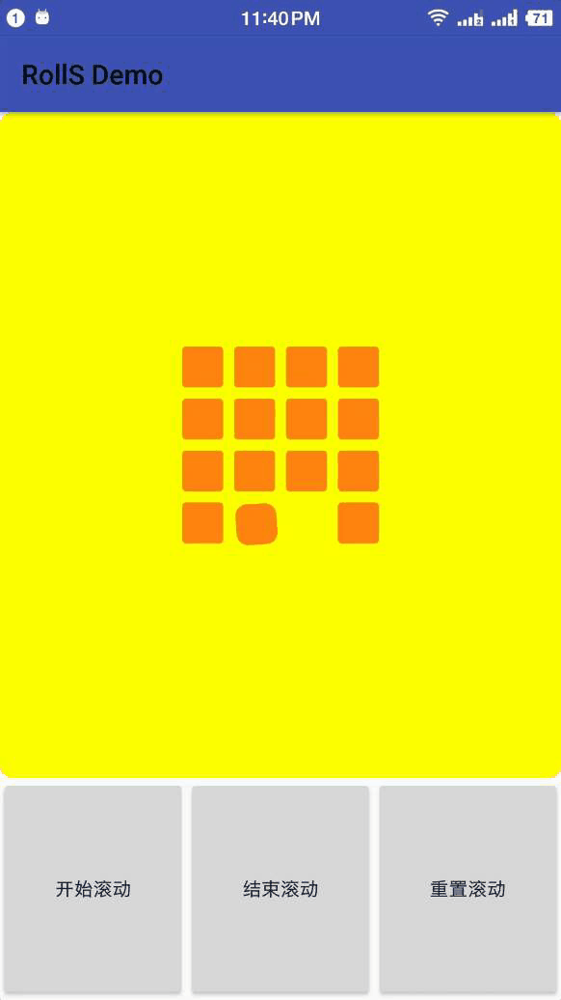

# Halohoop Custom Widget
# RollSquareView

    作为原创者，星星数确实干不过一些热门博主，我也很无奈啊，以下链接为修改我的类名之后重新发的项目。
    https://github.com/Carson-Ho/Kawaii_LoadingView
    虽然如此，但也非常感谢此博主喜欢这个作品。

---

---

---

## How to use it

Demo:

    <com.halohoop.rollsquareview.widgets.RollSquareView
        android:id="@+id/rollSquareView1"
        android:layout_width="match_parent"
        android:layout_height="0dp"
        android:layout_weight="3"
        android:background="@drawable/default_bg"
        app:half_rect_width="15dp"
        app:rect_divier_width="8dp"
        app:start_empty_position="3"
        app:is_clockwise="false"
        app:line_count="4"
        app:roll_speed="250"
        app:fix_round_cornor="10"
        app:roll_round_cornor="30"
        android:visibility="visible"
        app:roll_interpolator="@android:anim/anticipate_overshoot_interpolator"
        app:square_color="#ff820e" />

## Setting Description

* half\_rect\_width:半个方块的宽度，单位dp
* rect\_divier\_width:方块之间间隔宽度，单位dp
* start\_empty\_position:初始空出的位置
* is\_clockwise:是否顺时针旋转
* line\_count:一行的数量，最少为3
* fix\_round\_cornor:固定的方框的圆角半径
* roll\_round\_cornor:旋转的方框的圆角半径，如果这两个圆角半径设置成不一样的值就会得到上面图1的效果，设置成一样就是图2.
* square\_color:方块的颜色。使用十六进制代码的形式（如：#333、#8e8e8e）
* roll\_interpolator:动画的插值器，不设置默认是线性。
* roll\_speed:滚动的速度。

## Branch Description

* [new_branch1](https://github.com/halohoop/RollSquareView/tree/new_branch1):新增画棍子. 

## License

    Copyright 2017, Halohoop

    Licensed under the Apache License, Version 2.0 (the "License");
    you may not use this file except in compliance with the License.
    You may obtain a copy of the License at

       http://www.apache.org/licenses/LICENSE-2.0

    Unless required by applicable law or agreed to in writing, software
    distributed under the License is distributed on an "AS IS" BASIS,
    WITHOUT WARRANTIES OR CONDITIONS OF ANY KIND, either express or implied.
    See the License for the specific language governing permissions and
    limitations under the License.
